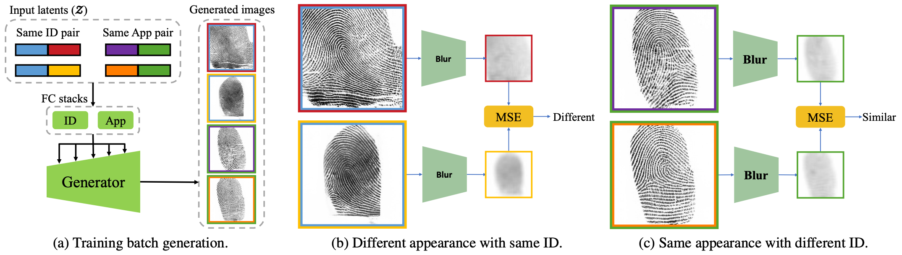
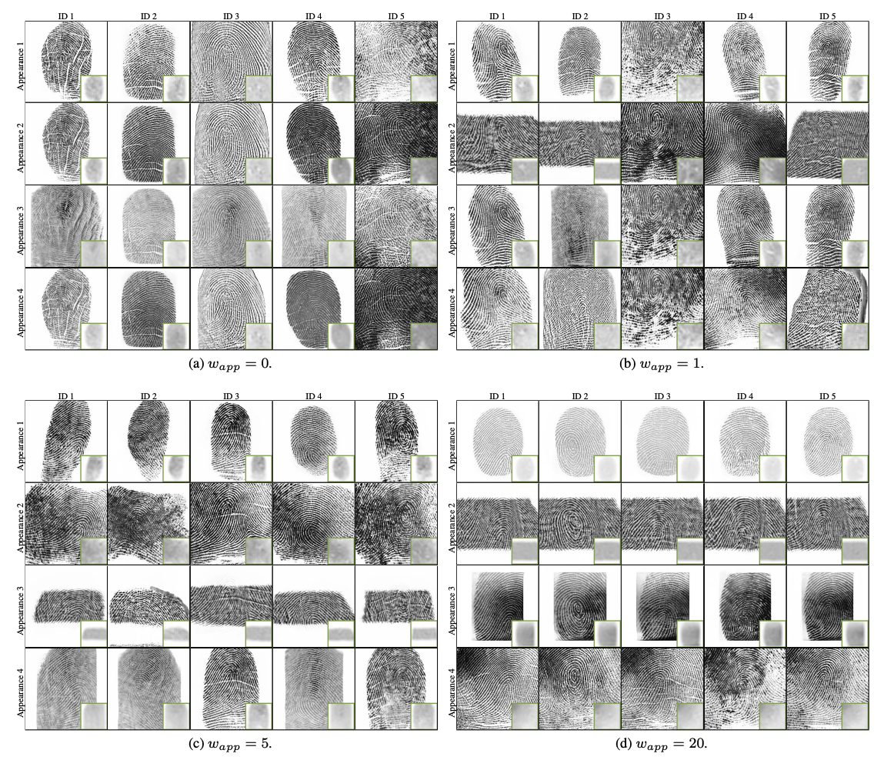
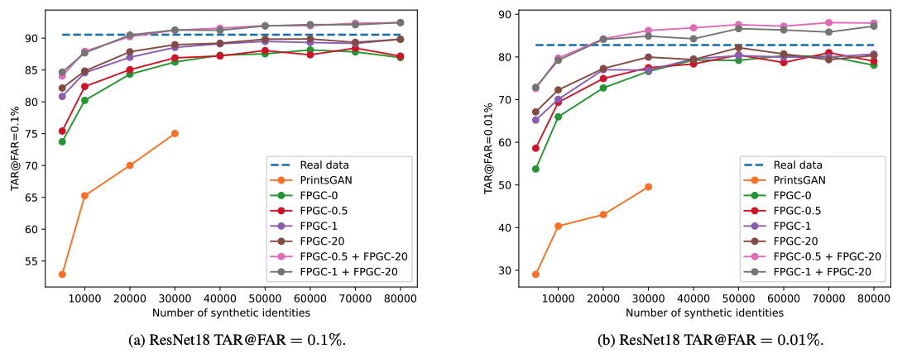

# FPGAN-Control: A Controllable Fingerprint Generator for Training with Synthetic Data

<center></center>

This is a PyTorch implementation of the following paper:
**FPGAN-Control: A Controllable Fingerprint Generator for Training with Synthetic Data**, WACV 2024, [[paper]](https://arxiv.org/abs/2310.19024) [[project page]](https://alonshoshan10.github.io/fpgan_control/).
Alon Shoshan, Nadav Bhonker, Emanuel Ben Baruch, Ori Nizan, Igor Kviatkovsky, Joshua Engelsma, Manoj Aggarwal and Gerard Medioni.

## Abstract
Training fingerprint recognition models using synthetic data has recently gained increased attention in the biometric community as it alleviates the dependency on sensitive personal data. Existing approaches for fingerprint generation are limited in their ability to generate diverse impressions of the same finger, a key property for providing effective data for training recognition models. To address this gap, we present FPGAN-Control, an identity preserving image generation framework which enables control over the fingerprint's image appearance (e.g., fingerprint type, acquisition device, pressure level) of generated fingerprints. We introduce a novel appearance loss that encourages disentanglement between the fingerprint's identity and appearance properties. In our experiments, we used the publicly available NIST SD302 (N2N) dataset for training the FPGAN-Control model. We demonstrate the merits of FPGAN-Control, both quantitatively and qualitatively, in terms of identity preservation level, degree of appearance control, and low synthetic-to-real domain gap. Finally, training recognition models using only synthetic datasets generated by FPGAN-Control lead to recognition accuracies that are on par or even surpass models trained using real data. To the best of our knowledge, this is the first work to demonstrate this.
<br>
<br>
<br>


In each training batch (a), both same ID pairs and same appearance pairs are
generated. Same ID pairs have the same ID latent vector while same appearance pairs have the same appearance latent vector. The color of
the inner image border corresponds to the fingerprint ID and the color of the outer border corresponds to the fingerprint appearance. Each
image in the batch is blurred and downsampled, effectively removing it’s barometric features while still obtaining many of its appearance
features. Blurred images with different appearance latents are pushed one from another (b), while blurred images with the same appearance
latent are pulled towards each other (c).

## Generation results of FPGAN-Control trained using different w<sub>app</sub>


For a specific FPGAN-Control model, each column
represents images generated with the same ID latent vector input and each row represents images generated with the same appearance
latent vector input. For visualization of the appearance loss, the small images in green borders show the blurred representation of the
fingerprint image used by the loss.


## Training with synthetic data


Accuracy vs. number of synthetic identities used during training: 
Real data corresponds to training the model with the real dataset only, 
while the rest of the models were trained purely on synthetic identities.

## Citation
Please consider citing our work if you find it useful for your research:
```
@InProceedings{Shoshan_2024_WACV,
    author    = {Shoshan, Alon and Bhonker, Nadav and Ben Baruch, Emanuel and Nizan, Ori and Kviatkovsky, Igor and Engelsma, Joshua and Aggarwal, Manoj and Medioni, G\'erard},
    title     = {FPGAN-Control: A Controllable Fingerprint Generator for Training With Synthetic Data},
    booktitle = {Proceedings of the IEEE/CVF Winter Conference on Applications of Computer Vision (WACV)},
    month     = {January},
    year      = {2024},
    pages     = {6067-6076}
}
```


## Security

See [CONTRIBUTING](CONTRIBUTING.md#security-issue-notifications) for more information.

## License

This library is licensed under the Attribution-NonCommercial 4.0 International License.

